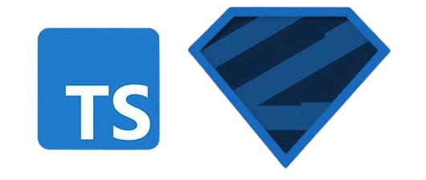

<a name="top"></a>

<p align="center">
  
</p>
<p align="center">
  <span style="font-size: 24px; font-weight: bold;">Zod To Typescript</span>
</p>
<p align="center">
  <a href='#'>
    
  </a>
  <a href="#">
      
    </a>
</p>

`@duplojs/zod-to-typescript` is a library that converts Zod schemas to TypeScript types.

## Packages

- [@duplojs/zod-to-typescript](https://www.npmjs.com/package/@duplojs/zod-to-typescript)

	

## Download and Installation

To consume `@duplojs/zod-to-typescript`, you need to install the npm package and typescript.
```bash
npm install @duplojs/zod-to-typescript typescript
```

## Usage

### 1. Import necessary modules

```ts
import { z as zod } from 'zod';
import { ZodToTypescript } from '@duplojs/zod-to-typescript';
```

### 2. Define Zod schema

Create a Zod schema that you want to convert to TypeScript:
```ts
const schema = zod.object({
  name: zod.string(),
  age: zod.number(),
  isStudent: zod.boolean(),
});
```

### 3. Convert Zod schema to TypeScript type

Use the `convert` method of `ZodToTypescript` to convert the Zod schema to a TypeScript type declaration:
```ts
const options: ConvertOptions = {
    name: "User", // Optional: Specify a name for the TypeScript type
    export: true, // Optional: Export the TypeScript type
};

const tsType = ZodToTypescript.convert(userSchema, options);
console.log(tsType);
```

### 4. Output the TypeScript type

The `convert` method returns a string containing the TypeScript type declaration. You can output this string to a file or use it directly in your code:
```ts
// Example output:
export type User = {
  name: string;
  age: number;
  isStudent: boolean;
};
```

### 5. Full Example

```ts
import { z as zod } from 'zod';
import { ZodToTypescript } from '@duplojs/zod-to-typescript';

const schema = zod.object({
  name: zod.string(),
  age: zod.number(),
  isStudent: zod.boolean(),
});

const options: ConvertOptions = {
	name: "User",
	export: true,
};

const tsType = ZodToTypescript.convert(schema, options);
console.log(tsType);
// Output: export type User = { name: string; age: number; isStudent: boolean; };
```

`ZodToTypescript` is a powerful utility for converting Zod schemas to TypeScript type declarations. By following this guide, you can easily integrate it into your TypeScript projects and extend it to support custom Zod types.

### More Examples

For more examples, please check the unit tests for each type in the `tests` directory. The tests provide comprehensive examples of how to use each supported type with `ZodToTypescript`.

## Supported Types

| Zod Type          | Supported | Test Link                                  |
|-------------------|-----------|--------------------------------------------|
| `z.string()`      | ✅         | [Test](./scripts/typescriptTransformators/string.test.ts) |
| `z.number()`      | ✅         | [Test](./scripts/typescriptTransformators/number.test.ts) |
| `z.boolean()`     | ✅         | [Test](./scripts/typescriptTransformators/boolean.test.ts) |
| `z.bigint()`      | ✅         | [Test](./scripts/typescriptTransformators/bigint.test.ts) |
| `z.symbol()`      | ❌         | |
| `z.null()`        | ✅         | [Test](./scripts/typescriptTransformators/null.test.ts) |
| `z.undefined()`   | ✅         | [Test](./scripts/typescriptTransformators/undefined.test.ts) |
| `z.literal()`     | ✅         | [Test](./scripts/typescriptTransformators/literal.test.ts) |
| `z.array()`       | ✅         | [Test](./scripts/typescriptTransformators/array.test.ts) |
| `z.object()`      | ✅         | [Test](./scripts/typescriptTransformators/object.test.ts) |
| `z.union()`       | ✅         | [Test](./scripts/typescriptTransformators/union.test.ts) |
| `z.intersection()`| ✅         | [Test](./scripts/typescriptTransformators/intersection.test.ts) |
| `z.tuple()`       | ✅         | [Test](./scripts/typescriptTransformators/tuple.test.ts) |
| `z.record()`      | ✅         | [Test](./scripts/typescriptTransformators/record.test.ts) |
| `z.map()`         | ✅         | [Test](./scripts/typescriptTransformators/map.test.ts) |
| `z.set()`         | ✅         | [Test](./scripts/typescriptTransformators/set.test.ts) |
| `z.date()`        | ✅         | [Test](./scripts/typescriptTransformators/date.test.ts) |
| `z.function()`    | ✅         | [Test](./scripts/typescriptTransformators/function.test.ts) |
| `.instanceof()`  | ❌         | |
| `z.optional()`    | ✅         | [Test](./scripts/typescriptTransformators/optional.test.ts) |
| `z.nullable()`    | ✅         | [Test](./scripts/typescriptTransformators/nullable.test.ts) |
| `z.any()`         | ✅         | [Test](./scripts/typescriptTransformators/any.test.ts) |
| `z.unknown()`     | ✅         | [Test](./scripts/typescriptTransformators/unknown.test.ts) |
| `z.never()`       | ✅         | [Test](./scripts/typescriptTransformators/never.test.ts) |
| `z.void()`        | ✅         | [Test](./scripts/typescriptTransformators/void.test.ts) |
| `z.enum()`        | ✅         | [Test](./scripts/typescriptTransformators/enum.test.ts) |
| `z.nativeEnum()`  | ✅         | [Test](./scripts/typescriptTransformators/nativeEnum.test.ts) |
| `z.lazy()`        | ✅         | [Test](./scripts/typescriptTransformators/lazy.test.ts) |
| `z.promise()`     | ✅         | [Test](./scripts/typescriptTransformators/promise.test.ts) |
| `z.preprocess()`  | ❌         | |
| `z.transform()`   | ✅         | |
| `z.effect()`      | ✅         | [Test](./scripts/typescriptTransformators/effect.test.ts) |
| `.brand<"TypeName">()` | ❌    | |
| `.refine()`       | ✅         | |
| `.describe()`     | ✅         | |


## Acknowledgements

I would like to thank [sachinraja](https://github.com/sachinraja) for creating the [zod-to-ts zod](https://github.com/sachinraja/zod-to-ts) package, which served as an inspiration for this project.

